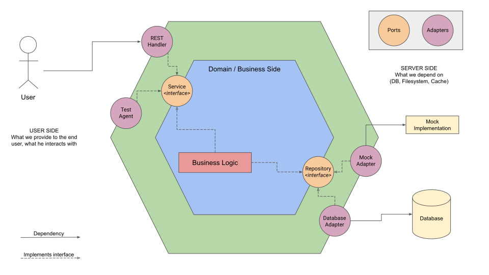

# API Products exercise

## Introduction
The intended solution in this exercise is based on my own experience and some readed books.

## Technologies used
- Go 1.17.10 as programming language
- Gin-gonic 1.8.1 as a http server and router 
- PostgreSQL 13 as RDBMS
- Docker 20.10.12
- Docker Compose 1.29.2

## Design decisions made
- Although it is a relatively simple exercise, I developed it based (obviously) in my own experience but incorporating some stuff learned from books too: In this case it was **Hexagonal Architecture (HA)** also known as **Ports and Adapters**, the intensive usage of **SOLID principles** brings to me to make this decision, especially for Dependency Injection principle and Liskov Substituion principle.
- **Why don't use MVC**? Is a good question, the answer is really easy: I think that HA flows more natural and give more abstraction and isolation of the components than MVC, this means less coupling among the layers too. Although HA is agnostic, the implementation with Go is wonderful, there are many readings about that.
- Docker / Docker compose usage: this decision was made at first of the development but incorporated later, the reason is **because the time is limited** and I needed developing the solution as soon as posible. This isolation with docker gives more confidence at the time to run the app without worries to fail.
- The database container has a healthchecker for avoid logging errors from the app when the app tries to connect to database, the tradeoff of that is a new error from database about `role "root" does not exist`, but all the system works fine.
- The usage of PostgreSQL is related to ease to usage, but I wanted at first time use 2 database to switch and test the repository pattern (the second one db keep in mind was MongoDB).

## Hexagonal Architecture Design App



## Bootstrapping
Inside the project, I wrote a makefile to save time typing the commands, especially for docker compose and run tests.

```bash
# Build and run the project with docker compose
# the first time it take time, but was the
# multistage approach was incorporated the next times
# this bootstrapping lasts lesser

$ make dcu # dcu means 'docker compose up' (and build in this case with --build flag)

# Stop docker compose containers
$ make dcd # dcd means 'docker compose down'

# Command for run the tests which cleans cache too.
$ make tests

```
**Swagger URL**: http://localhost:8000/swagger/index.html

## Endpoints

| **Endpoint** | **HTTP Verb** | **Description** | **Response** |
|---|---|---|---|
| localhost:8000/api/v1/products/ | GET | Retrieves all products (without pagination) | 200 OK Array of products \| 404 Not found |
| localhost:8000/api/v1/products/:sku | GET | Retrieves one product by SKU | 200 OK one product \| 404 Not found |
| localhost:8000/api/v1/products/ | POST | Creates a new product | 201 OK new product \| 422 Unprocessable entity |
| localhost:8000/api/v1/products/:sku | PUT | Updates an existing product | 200 OK existing product \| 422 Unprocessable entity \| 404 Not found |
| localhost:8000/api/v1/products/:sku | DELETE | Delete an existing product | 204 No content |

## Pendings
- Results pagination
- Improve logging
- Graceful shutdown
- Deployment in the cloud
